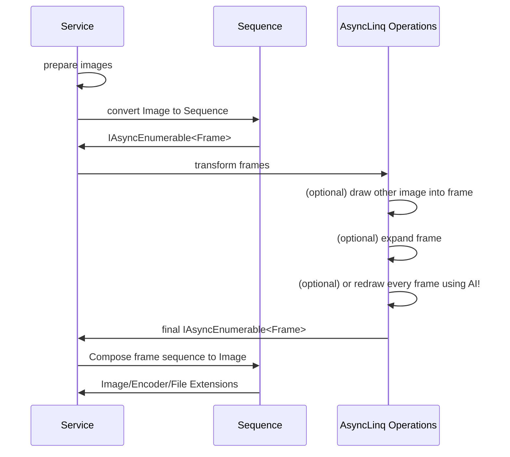

MemeFactory
----
A meme processing utility based on ImageSharp.

## Install
```xml
<PackageReference Include="MemeFactory.Core" Version="1.0.0-alpha.39" />
```

## Design


## Usage
See [MemeFactory.Samples](MemeFactory.Samples)

## Matting image using AI
```xml
<PackageReference Include="MemeFactory.Matting.Onnx" Version="1.0.0-alpha.39" />
```
```csharp
IAsyncEnumerable<Frame> frames;

var model = new RmbgConfiguration("your_model_path");
using var result = frames.ApplyModel(model).AutoComposeAsync();

await result.Image.SaveAsync("result." + result.Extension, result.Encoder);
```
See also: [RMBG-2.0](https://huggingface.co/briaai/RMBG-2.0) / [ModNet](https://github.com/ZHKKKe/MODNet) / [PaddleSeg/Matting](https://github.com/PaddlePaddle/PaddleSeg/tree/develop/Matting) 

> ⚠ Note: This package does not include any ONNX runtime package,
> please reference at least one ONNX runtime native package in your project.

## Processing image with ffmpeg
```xml
<PackageReference Include="MemeFactory.Ffmpeg" Version="1.0.0-alpha.39" />
```
```csharp
IAsyncEnumerable<Frame> frames;

frames.SpeedUp(1.0f);
```
> ⚠ Note: This package does not include any ffmpeg library or executable file,
> please install ffmpeg on your system. 

## Processing image with OpenCv
```xml
<PackageReference Include="MemeFactory.OpenCv" Version="1.0.0-alpha.39" />
```
```csharp
IAsyncEnumerable<Frame> frames;

frames.OpenCv(MemeCv.RadialBlur())
```
> ⚠ Note: This package does not include any OpenCV binary file,
> please reference `OpenCvSharp4` runtime package in your project.


### MemeFactory.OpenCv built-in filters
> Use `MemeCv` to access all built-in filters

| Method       | Description                                                            |
|--------------|------------------------------------------------------------------------|
| RadialBlur   | Apply a radial blur filter to every frame                              |
| FloodMatting | Select a point and matting image using the color of the selected point |

## Core built-in filters 

| Method                | Description                                                                                                                  |
|-----------------------|------------------------------------------------------------------------------------------------------------------------------|
| DuplicateFrame        | Duplicate every frame in sequence, e.g. `1234` to `1122334`                                                                  |
| Loop                  | Loop the entire sequence, e.g. `1234` to `12341234`                                                                          |
| FrameBasedZipSequence | Merge two sequences frame by frame                                                                                           |
| AutoComposeAsync      | Evaluate all processors and generate the final image, and the output format is determined by the count of the final sequence | 
| EachFrame             | Apply a FrameProcessor to every frame                                                                                        |
| Rotation              | Rotate the sequence frame by frame while incrementing the angle each frame                                                   |
| Sliding               | Slide sequence from edge to edge                                                                                             |
| TimelineSliding       | Not only sliding the canvas, also including the timeline                                                                     |
| Flip                  | Flip every frame                                                                                                             |
| Resize                | Resize every frame                                                                                                           |
| BackgroundColor       | Replace the background color of every frame                                                                                  |
| Glow                  | Apply a radial glow to every frame                                                                                           |
| Vignette              | Apply a radial vignette to every frame                                                                                       |
| BokehBlur             | Apply a Bokeh blur filter to every frame                                                                                     |
| GaussianBlur          | Apply a Gaussian blur filter to every frame                                                                                  |
| GaussianSharpen       | Apply a Gaussian sharpen filter to every frame                                                                               |
| BlackWhite            | Apply a black white filter to every frame                                                                                    |
| Invert                | Apply a invert color filter to every frame                                                                                   |
| Kodachrome            | Apply a Kodachrome filter to every frame                                                                                     |
| Polaroid              | Apply a Polaroid filter to every frame                                                                                       |
| Pixelate              | Apply a pixelate filter to every frame                                                                                       |
| Contrast              | Adjust the contrast of every frame                                                                                           |
| Opacity               | Adjust the opacity of every frame                                                                                            |
| Hue                   | Adjust the hue of every frame                                                                                                |
| Saturate              | Adjust the saturate of every frame                                                                                           |
| Lightness             | Adjust the lightness of every frame                                                                                          |
| Brightness            | Adjust the rightness of every frame                                                                                          |
| ProjectiveTransform   | Apply projective transform matrix to every frame                                                                             |
